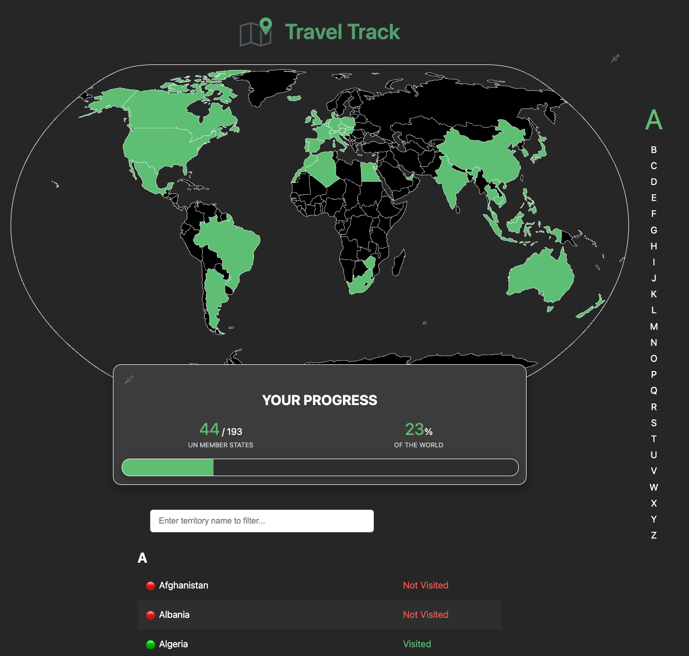

# Travel Track


**Travel Track** encourages you to travel the world by allowing you to track to
which territories and percentage of the world you have been.

Travel Track is a self-hosted tool, which puts you in control of your data and
experience.

---

## App Preview



---

## Getting Started

### Prerequisites

- [Node.js](https://nodejs.org/) (v24 or later recommended)

### Install Dependencies

```bash
npm install
```

## Running the Application

### Development Mode

Run the app locally with hot-reloading:

```bash
npm run dev
```

Or to expose on your local network:

```bash
npm run dev-host
```

### Production Build

Build the app for production:

```bash
npm run build
```

The application will be created under the `/dist/` folder.

Preview the production build locally:

```bash
npm run preview
```

## Testing

- **Unit tests:**

  ```bash
  npm run test:unit
  ```

- **End-to-end tests:**

  ```bash
  npm run test:e2e
  ```

- **Linting:**

  ```bash
  npm run lint
  ```

- **Formatting:**

  ```bash
  npm run format
  ```

## Docker Deployment

You can run Travel Track using Docker and Docker Compose.

### Build and Run with Docker Compose

1. Build and start the service:

   ```bash
   docker compose up --build
   ```

   This will build the Docker image and start the app at [http://localhost:5173](http://localhost:5173).

2. To stop the service:

   ```bash
   docker compose down
   ```

### Dockerfile Details

- The app is built using Node.js and served with
  [`serve`](https://www.npmjs.com/package/serve) on port 3000 (mapped to 5173
  on your host).

- The Dockerfile handles installing dependencies, building the app, and serving
  the static files from the `dist` directory.

---

## Project Structure

- `src/` - Application source code
- `public/` - Static assets
- `dist/` - Production build output
- `Dockerfile` - Docker build instructions
- `docker-compose.yaml` - Docker Compose configuration

---

## License

This project is self-hosted and open for personal use.

*The software is provided "as is", without warranty of any kind, express or
implied, including but not limited to the warranties of merchantability, fitness
for a particular purpose and noninfringement. In no event shall the authors be
liable for any claim, damages or other liability, whether in an action of
contract, tort or otherwise, arising from, out of or in connection with the
software or the use or other dealings in the software.*
